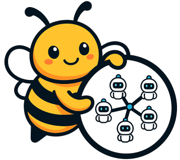
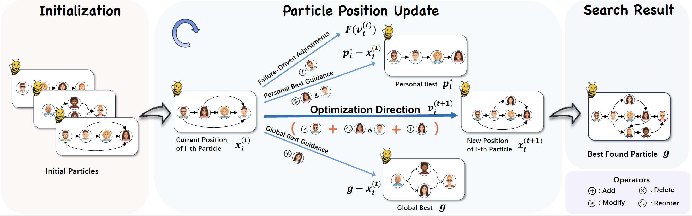

<h1 align="center">
   SwarmAgentic: Towards Fully Automated Agentic System Generation via Swarm Intelligence
</h1>

<p align="center">
  <a href="./LICENSE"></a>
  <a href="https://arxiv.org/pdf/2506.15672"></a>
  <a href="https://2025.emnlp.org/"></a>
</p>

SwarmAgentic delivers the first fully automated pipeline for agentic system generation, jointly optimizing from-scratch agent creation, role specialization, and collaboration through language-driven particle swarm optimization (PSO). 

<p align="center">
  
</p>

<p align="center"><em>Figure 1. Overview of the SwarmAgentic pipeline. Starting from only a task description and objective, the system autonomously generates and optimizes multi-agent architectures through language-driven particle swarm evolution. Each iteration involves execution, LLM-based failure analysis, and targeted refinement, yielding a fully functional and collaboratively optimized system built from scratch.
</em></p>

## Table of Contents

- [Overview](#overview)
- [How It Works](#how-it-works)
- [Setup](#setup)
- [Running SwarmAgentic](#running-swarmagentic)
- [Data and Evaluation](#data-and-evaluation)
- [Extending to New Domains](#extending-to-new-domains)
- [Safety Considerations](#safety-considerations)
- [Repository Structure](#repository-structure)
- [Citing](#citing)
- [License](#license)

## Overview

- Fully automated multi-agent system discovery with language-guided PSO updates.
- Self-optimizing agent behaviors and collaboration without predefined templates.
- Supports diverse domains, including creative writing, travel planning, scheduling, and reasoning.
- Modular design enables rapid evaluation and domain adaptation.

## How It Works

SwarmAgentic iteratively discovers agent teams by:
1. **Generating** roles and collaboration plans directly from the task specification.
2. **Executing** each candidate team on sampled tasks while logging role interactions and scores.
3. **Diagnosing** failures with LLM-guided analysis (for example `failure_identify.py`) to surface missing skills or coordination gaps.
4. **Updating** the team via particle swarm optimization, adjusting prompts, and topology.
5. **Selecting** the best-performing particle and exporting artifacts (`save.jsonl`) for reuse or evaluation.

**Key modules**

| Module | Location | Purpose |
| --- | --- | --- |
| PSO driver | `*/pso.py` | Runs the optimization loop, logging, and checkpointing. |
| Failure analysis | `{domain}/prompt/failure_identify.py` | Generates targeted repair plans from execution traces. |
| Domain runtime | `{domain}/func.py` | Implements task-specific forward execution and tool usage. |
| Prompts | `{domain}/prompt/` | Stores task instructions, role schemas, and guardrails. |
| Evaluation | `{domain}/test.py`| Scores generations, writes metrics, and surfaces issues. |
| data | `{domain}/data/` | Houses datasets. |

## Setup
```bash
conda create -n swarm python=3.11
conda activate swarm
pip install -r requirements.txt

# provide your OpenAI API key
export OPENAI_API_KEY="YOUR KEY HERE"
```

## Running SwarmAgentic

All commands assume you start inside the target domain directory.

- **Train + evaluate (TravelPlanner)**
  ```bash
  conda activate swarm
  cd travelplanner/swarm
  python pso.py --max_iteration 5 --dataset data/train_45.jsonl --ref_info data/train_ref_info.jsonl
  python test.py --particle_idx -1
  ```
- **Evaluate an existing particle**
  ```bash
  cd travelplanner/swarm
  python test.py --particle_idx -1
  ```
- **Train (Creative Writing)**
  ```bash
  cd creative_writing
  python pso.py --max_iteration 10 --dataset data/data_100_random_text.txt
  ```

**Common flags**

For `pso.py`:
- `--max_iteration`: maximum number of PSO iterations.
- `--settings`: temperature settings for each particle (e.g., `--settings [0.2 0.4 0.6 0.8 1.0]`).
- `--model`: model name to use (default: gpt-4o-mini).
- `--max_workers`: maximum number of worker threads (default: None).
- `--save_dir`: directory to save results.
- For TravelPlanner only:
  - `--resume`: restarts optimization from an existing checkpoint.
  - `--state_idx`: chooses which saved state to resume from (`-1` for the latest).

For `test.py`:
- `--particle_idx`: chooses which saved particle to evaluate (`-1` grabs the latest entry in `save.jsonl`).
- `--model`: model name to use for execution (default: gpt-4o-mini).
- `--eval_model`: model name to use for evaluation (default: gpt-4o-mini).

## Data and Evaluation

- **Data layout**: Each domain ships with a `data/` directory containing `train`, and `test` splits. File formats are typically plain text or JSONL with tab-separated fields for prompts and expected responses.
- **Preparing new data**: Drop cleaned files into the domain `data/` folder.
- **Evaluation artifacts**: `test.py` writes metrics to `results/<run_name>/metrics.json` and stores generations for manual review. During PSO, aggregate scores and trace summaries accumulate in `save.jsonl`.
- **Interpreting scores**: Creative tasks report 1-10 coherence ratings, planning tasks report constraint satisfaction rates, and reasoning tasks report exact-match accuracy. 

## Extending to New Domains

You can easily adapt SwarmAgentic to new domains by following these steps:

#### 1. Define Your Task (`prompt/base.py`)

Define the high-level task description that will guide the multi-agent team generation:

```python
TASK_MINI = '''Your domain-specific task description here...'''

FUNCTION_DESCRIPTION = """
Description of what the forward function should do for your task.
The function signature should be 'def forward(team):'.
Define what the function should return.
"""
```

**Example:** For creative writing, `TASK_MINI` describes the narrative coherence task with specific constraints.

#### 2. Implement Domain-Specific Evaluation (`eval.py`)

Create an `evaluate()` function that scores agent outputs. You'll also need to format task instances in `pso.py`:

```python
def evaluate(llm, task, response):
    """Evaluate the quality of the agent's response.
    
    Returns:
        (score, problem): score is the evaluation metric,
                         problem describes issues if score is not perfect
    """
    # Implement your domain-specific evaluation logic
    # For creative writing: coherence scoring (1-10)
    # For reasoning tasks: correctness checking (0/1)
    # For planning tasks: constraint satisfaction
```

The framework will automatically generate specialized multi-agent teams for your task and optimize team structure and coordination through PSO.

#### 3. Register the Domain Pipeline (`pso.py`)

- Load prompts and evaluators defined above.
- Configure PSO hyperparameters (`max_iters`, `population_size`, velocity damping) to match the complexity of your task.
- Ensure `pso.py` exports the artifacts required by `test.py` (`save.jsonl`).

#### 4. Prepare Your Dataset

- Place your training and test datasets under `data/` with consistent formatting (plain text or JSONL).

#### 5. Run Training and Evaluation

- Train with PSO: `python pso.py --max_iteration 10 --dataset data/your_train.jsonl`
- After training completes, PSO saves all particles to `save.jsonl`. Choose the best particle and evaluate: `python test.py --particle_idx -1`

## Safety Considerations
> [!WARNING]  
> The code in this repository involves executing untrusted model-generated code. We strongly advise users to be aware of this safety concern. While it is highly unlikely that model-generated code will perform overtly malicious actions in our current settings and with the models we use, such code may still act destructively due to limitations in model capability or alignment. By using this repository, you acknowledge and accept these risks.

- Run experiments inside sandboxed containers or restricted user accounts to reduce blast radius.
- Scope API keys with least privilege and rotate them periodically.
- Inspect artifacts in `results/` and `logs/` before deploying agent teams in production environments.

## Repository Structure

```
.
├── creative_writing/
│   ├── data/
│   ├── prompt/
│   └── pso.py
├── mgsm/
│   ├── data/
│   ├── prompt/
│   └── pso.py
├── natural_plan/
│   ├── _calendar/
│   ├── _meeting/
│   └── _trip/
├── travelplanner/
│   ├── agents/
│   ├── evaluation/
│   └── swarm/
│     ├── pso.py
├── misc/
│   └── main.png
├── README.md
└── requirements.txt
```

Add new domain folders following this template to reuse the PSO drivers and evaluation tooling.

## Citing
If you find this project useful, please consider citing:
```
@misc{zhang2025swarmagenticfullyautomatedagentic,
  title={SwarmAgentic: Towards Fully Automated Agentic System Generation via Swarm Intelligence},
  author={Yao Zhang and Chenyang Lin and Shijie Tang and Haokun Chen and Shijie Zhou and Yunpu Ma and Volker Tresp},
  year={2025},
  eprint={2506.15672},
  archivePrefix={arXiv},
  primaryClass={cs.AI},
  url={https://arxiv.org/abs/2506.15672},
}

```

## License

SwarmAgentic is released under the [Apache 2.0 License](./LICENSE).